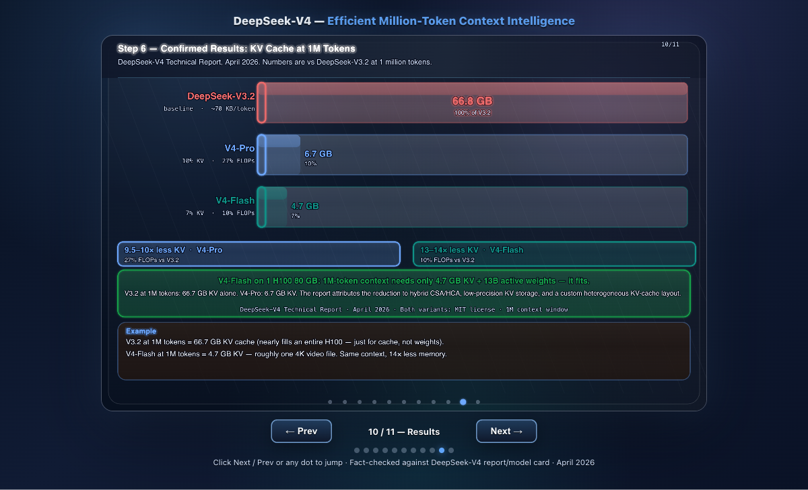
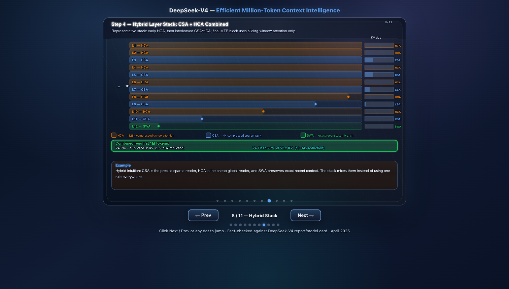

# The KV Cache Evolution: From Attention Heads to DeepSeek V4's 90% Memory Breakthrough

**Author:** [Pradip Tivhale](https://github.com/thepradip) &nbsp;|&nbsp; 19 Chapters &nbsp;|&nbsp; 32 Papers &nbsp;|&nbsp; Interactive Visualizations

[](https://thepradip.github.io/KVCache-research/)
[](https://thepradip.github.io/KVCache-research/#sec18)
[](https://thepradip.github.io/KVCache-research/#sec19)

---

## 🎬 Interactive Demo

<p align="center">
  <a href="https://thepradip.github.io/KVCache-research/" target="_blank">
    
  </a>
</p>

<p align="center">
  <a href="https://thepradip.github.io/KVCache-research/">
    <strong>▶ Open Interactive Article with Animations</strong>
  </a>
  &nbsp;&nbsp;|&nbsp;&nbsp;
  <a href="deepseek_v4_animation.html">
    <strong>🎞️ DeepSeek V4 Hybrid Attention Animation</strong>
  </a>
</p>

---

## 🧠 What is KV Cache? (Explain Like I'm 10)

Imagine you're having a conversation with a friend. Every time your friend wants to reply, they re-read **the entire conversation from the beginning** — every single word — before saying the next sentence. That's exhausting and slow!

**KV Cache is like giving your friend a notepad.** Instead of re-reading everything, they jot down the key points as you talk and just glance at their notes. Each new word only needs to look at the notepad — not the whole conversation.

In AI terms:
- **K (Key)** = the notepad index — *"what topics have we discussed?"*
- **V (Value)** = the actual notes — *"what were the details?"*
- **Q (Query)** = the current question — *"what do I need right now?"*

The problem? **The notepad gets huge.** For a 1-million-token conversation, storing K and V for every word in every layer of a 70B model can take **hundreds of gigabytes of GPU memory.** That's what this entire research is about — making the notepad smaller, faster, and smarter.

---

## 📚 All 19 Chapters

| # | Chapter | The Big Idea | Memory Impact |
|---|---------|-------------|--------------|
| 1 | **Transformers & Attention** | How AI reads text using Q, K, V matrices | Baseline |
| 2 | **KV Cache Basics** | Cache the notepad instead of re-reading | ✅ Speed ↑ |
| 3 | **Multi-Head Attention (MHA)** | Many notepads in parallel — richer understanding | ❌ Memory ↑↑ |
| 4 | **Multi-Query Attention (MQA)** | All heads share one notepad | ✅ Memory ↓ 8× |
| 5 | **Grouped-Query Attention (GQA)** | Groups of heads share notepads | ✅ Balance |
| 6 | **Multi-Head Latent Attention (MLA)** | Compress the notepad into a tiny summary | ✅ Memory ↓ 90% |
| 7 | **Cross-Layer Attention (CLA)** | Share notepads across layers too | ✅ Memory ↓ 50% |
| 8 | **PagedAttention** | Store notepad pages non-contiguously (like OS paging) | ✅ No waste |
| 9 | **Streaming LLM** | Throw away old notepad pages smartly | ✅ Infinite context |
| 10 | **KIVI Quantization** | Write notes in shorthand (2-bit) | ✅ Memory ↓ 4× |
| 11 | **KVQuant** | Smarter shorthand with per-channel scaling | ✅ Memory ↓ 6× |
| 12 | **TurboQuant** | Lossless 1-bit notepad compression | ✅ Memory ↓ 8× |
| 13 | **Bonsai 1-bit** | Prune the notepad to just the important parts | ✅ Memory ↓ 8× |
| 14 | **LLaMA 2/3/4** | Meta's evolution of attention efficiency | GQA → MLA |
| 15 | **Gemma & Qwen** | Google/Alibaba's approaches | GQA variants |
| 16 | **DeepSeek V2/V3** | MLA breakthrough — 93% KV reduction | ✅ Memory ↓ 93% |
| 17 | **Kimi K2 / Phi-4** | Long-context specialists | Hybrid MLA |
| 18 | **DeepSeek V4** 🔥 | 90% KV reduction at 1M tokens via CSA/HCA | ✅ Memory ↓ 90-93% |
| 19 | **DFlash** ⚡ | Block diffusion speculative decoding | ✅ Speed ↑↑ |

---

## 🔥 DeepSeek V4 — The Million-Token Breakthrough (Chapter 18)

> *"At one million tokens of context, V4-Pro needs only 10% of the KV cache that V3 required."*

### The Analogy
Old models re-wrote their entire notepad every few pages. DeepSeek V4 uses **two types of notepad pages**:
- 🗒️ **Compressed Sparse Attention (CSA)** pages — tiny summaries, written every layer
- 📋 **Hybrid Cross Attention (HCA)** pages — full detail, written every 8th layer

Only 1 in 8 layers keeps the full notepad. The rest use the tiny summary. Result: **90% less memory.**

### Key Innovations

| Innovation | What it does | Why it matters |
|-----------|-------------|----------------|
| **CSA (Compressed Sparse Attention)** | Compress K,V into low-rank matrices per token | 90% KV memory cut |
| **HCA (Hybrid Cross Attention)** | Full attention every 8 layers — anchors accuracy | Keeps quality high |
| **mHC (Manifold-Constrained Hyper-Connections)** | Stabilises signal across CSA/HCA layer alternation | No quality degradation |
| **DeepSeek-V4-Flash** | Even more aggressive compression (93% reduction) | 7× cheaper inference |

### Pros & Cons

| ✅ Pros | ❌ Cons |
|---------|---------|
| 90–93% KV cache reduction at 1M context | Complex alternating layer schedule |
| Runs on fewer GPUs at long context | mHC adds training complexity |
| SGLang inference support on day 1 | Still needs HCA full layers (can't go to 100%) |
| Open-sourced weights | CSA compression can miss rare tokens |

<p align="center">
  
</p>

---

## ⚡ DFlash — Speculative Decoding Meets Diffusion (Chapter 19)

### The Analogy
Normal AI writes one word at a time — like typing with one finger. **DFlash writes a whole block of words at once** using a draft model, then checks them all in parallel. It's like autocomplete for entire sentences, verified instantly.

### How it Works
1. A small **draft model** generates a block of N tokens simultaneously (non-autoregressive)
2. The large **verifier model** checks all N tokens in one forward pass — reusing the KV cache
3. Accepted tokens are kept; rejected ones are regenerated
4. KV cache is shared across draft and verify steps — **no extra memory overhead**

### Pros & Cons

| ✅ Pros | ❌ Cons |
|---------|---------|
| 2–4× generation speedup | Requires a matched draft model |
| No extra KV cache memory | Block rejection wastes compute |
| Works with existing KV cache infrastructure | Draft model quality is critical |
| Parallelises what was serial | Harder to implement than greedy decoding |

---

## 🌊 Liquid Foundation Models (LFM) & Hybrid Attention

### What is LFM?

LFMs replace the standard Transformer attention with **liquid state machines** — recurrent networks that maintain a compressed hidden state instead of a growing KV cache. Think of it as replacing the notepad with a **memory chip** that automatically overwrites old information.

### How Hybrid Attention Works

Modern frontier models (DeepSeek V4, Kimi K2, Jamba) combine:

```
Layer 1  → Full Attention (MHA/GQA)    — big notepad, full context
Layer 2  → Full Attention
...
Layer 8  → SSM / Linear Attention      — tiny memory chip, constant size
Layer 9  → Full Attention
...
Layer 16 → SSM / Linear Attention
```

Every N layers, a recurrent layer (Mamba, RWKV, or linear attention) **compresses** the context into a fixed-size state. Full attention layers then attend over the compressed + recent context.

### Hybrid Attention: Pros & Cons

| ✅ Pros | ❌ Cons |
|---------|---------|
| O(1) memory for recurrent layers | Recurrent layers lose long-range precision |
| Constant inference cost regardless of context | Training is harder (BPTT through time) |
| Handles infinite-length sequences | Hybrid routing adds architectural complexity |
| Faster for long contexts vs pure Transformer | Less parallelisable on current GPU hardware |

---

## 📊 KV Cache Size: Real Numbers

| Model | Architecture | KV Cache @ 128K tokens |
|-------|-------------|----------------------|
| LLaMA 3 70B | GQA | ~18 GB |
| DeepSeek V3 | MLA | ~2 GB |
| DeepSeek V4-Pro | CSA/HCA | ~1.8 GB |
| DeepSeek V4-Flash | CSA+ | ~1.2 GB |
| Bonsai 8B (1-bit KV) | GQA + Quant | ~0.4 GB |

---

## 🗂️ Repository Contents

| File | Description |
|------|-------------|
| [`index.html`](index.html) | 📖 Main 19-chapter interactive article with animations |
| [`deepseek_v4_animation.html`](deepseek_v4_animation.html) | 🎞️ Animated DeepSeek V4 CSA/HCA hybrid attention diagram |
| [`KV_Cache_Research_Article_v10.html`](KV_Cache_Research_Article_v10.html) | 📄 Standalone research article (v10) |
| [`KV_Cache_LinkedIn_Article.md`](KV_Cache_LinkedIn_Article.md) | 💼 LinkedIn long-form article |
| [`KV_Cache_LinkedIn_Post.md`](KV_Cache_LinkedIn_Post.md) | 💼 LinkedIn short post |
| [`KV_Cache_X_Thread.md`](KV_Cache_X_Thread.md) | 🐦 X/Twitter thread |
| `deepseek_v4_*.png` | 🖼️ 26 architecture diagrams and visualizations |

---

## 📖 Key Papers Cited

| Paper | Key Contribution |
|-------|----------------|
| Vaswani et al. (2017) | Original Transformer — Q, K, V attention |
| Shazeer (2019) | Multi-Query Attention (MQA) |
| Ainslie et al. (2023) | Grouped-Query Attention (GQA) |
| DeepSeek-AI (2024) | Multi-Head Latent Attention (MLA) — 93% KV reduction |
| Kwon et al. (2023) | PagedAttention — vLLM |
| Liu et al. (2024) | KIVI — 2-bit KV quantization |
| Hooper et al. (2024) | KVQuant — per-channel quantization |
| DeepSeek-AI (2026) | DeepSeek-V4 — CSA/HCA hybrid, 90% KV at 1M tokens |
| Anonymous (2026) | DFlash — block diffusion speculative decoding |

---

## 🔗 Live Article

**Read the full interactive article with animations:**
👉 [https://thepradip.github.io/KVCache-research/](https://thepradip.github.io/KVCache-research/)

---

## License

MIT — for educational purposes. Pradip Tivhale, 2026.
